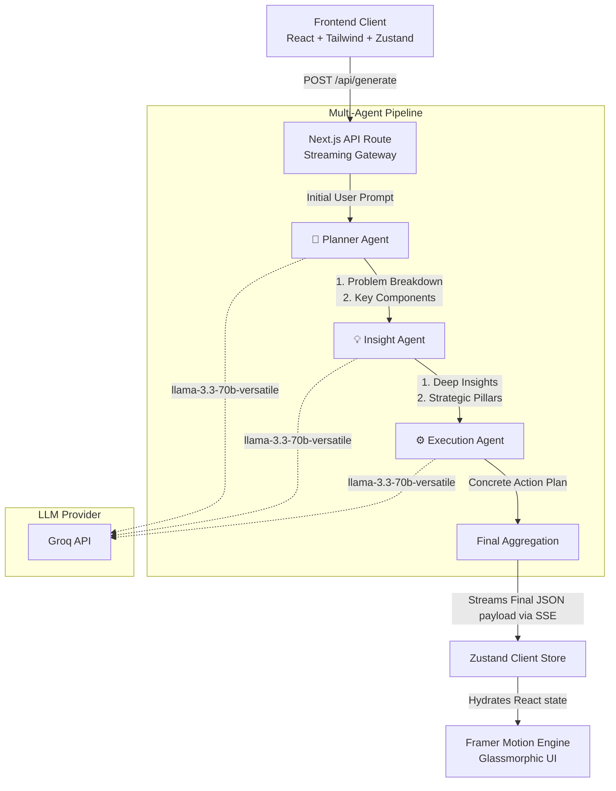

# 🚀 PlanForce AI — Strategic Planning Agent

**PlanForce AI** is an advanced, production-ready Next.js application that leverages a **Multi-Agent AI Architecture** to generate, critically analyze, edit, and export structured business execution plans. 

Built as a showcase for complex AI orchestration and modern frontend engineering, this intelligent system breaks down broad user statements into actionable, formatted, consultancy-grade reports.

---

## ✨ Core Features & Technical Achievements

### 🤖 1. Multi-Agent Orchestration (Groq Llama 3.3)
Instead of relying on a single brittle prompt, the application chains three highly specialized AI agents to construct the final report:
- **🧠 Planner Agent**: Breaks the core problem down into its fundamental challenges, sub-problems, and dimensions.
- **💡 Insight Agent**: Inherits the Planner's output and enriches it with strategic approaches, deep market insights, and structural pillars.
- **⚙️ Execution Agent**: Synthesizes the previous analyses into a concrete, 4-phase structured action plan layout.

### ✍️ 2. Targeted AI Section Editing
Users don't have to regenerate the entire report if they want a change. By clicking "AI Edit", users can target specific sections of the report to be independently re-processed by the AI.
- Includes quick-action presets ("Make it more detailed", "Make it more professional", "Shorten it").
- Supports custom natural language instructions.
- Safely processes edits in isolation while maintaining the surrounding report context.

### 📄 3. Professional Exports (Native DOCX & PDF)
The platform seamlessly translates the generated AI markdown into beautiful, native documents.
- **DOCX Export**: Parses the markdown into a heavily formatted MS Word document with custom-styled native tables, colored headers matching the UI theme, and professional typography.
- **PDF Export**: Flawless client-side rendering of the exact UI layout into a polished PDF report.

### ⚡ 4. Real-Time SSE Streaming & State Persistence
- **Server-Sent Events (SSE)**: Streams the reasoning and live progress of each agent back to the user in real-time.
- **Zustand Persistence**: Employs `localStorage` caching so users never lose an active report if they refresh or close the tab.
- **Version History**: The "Undo" system captures snapshots before every AI edit, allowing users to instantly revert a section to its previous state.

### 🎨 5. Premium UI/UX Design
- A cutting-edge, premium dark mode aesthetic featuring dynamic background orbs, glassmorphic floating panels, and custom neon gradients.
- Employs **Framer Motion** for smooth staggered entrance animations, sophisticated glowing hover states, and interactive multi-agent processing loaders.
- Fully responsive, structured 4-section presentation (Problem Breakdown, Stakeholders, Solution Approach, Action Plan).

---

## 🛠️ Technology Stack

- **Framework**: [Next.js 15](https://nextjs.org/) (App Router, Server API Routes)
- **AI SDK**: [Vercel AI SDK](https://sdk.vercel.ai/) (`generateText`)
- **LLM Provider**: [Groq](https://groq.com/) (`llama-3.3-70b-versatile` for blazing fast, highly-capable logic)
- **State Management**: [Zustand](https://zustand-demo.pmnd.rs/) (with `persist` middleware)
- **Styling**: Tailwind CSS v4 & custom generic variables
- **Animations**: Framer Motion
- **Document Exporting**: `docx` (Node DOCX generation), `jspdf` & `html2canvas`

---

## 🚀 Getting Started

### Prerequisites
- Node.js 18+
- A free **Groq API Key** (obtainable at [console.groq.com](https://console.groq.com))

### 1. Clone the repository
```bash
git clone https://github.com/AbdulKaleemShaik/AI-Planning-Agent.git
cd ai-planner
```

### 2. Install dependencies
```bash
npm install
```

### 3. Environment Variables
Create a `.env.local` file in the root directory and add your Groq key:
```env
GROQ_API_KEY=gsk_your_groq_api_key_here
```

### 4. Run the Development Server
```bash
npm run dev
```
Open [http://localhost:3000](http://localhost:3000) in your browser.

---

## 🏗️ Architecture Overview

The platform implements a **Sequential Multi-Agent Pipeline** utilizing Next.js API routes with Server-Sent Events (SSE) to stream reasoning steps and state updates in real-time.



### 🔄 Data & Execution Flow
1. **Client Request**: The client sends a `POST` request to `/api/generate` with the initial problem statement.
2. **SSE Stream Initialization**: The route holds a `ReadableStream` open to the client, actively emitting `agent-start` and `agent-complete` events to construct the visual "Agents Working" timeline.
3. **Sequential Processing**: 
   - The **Planner Agent** establishes the foundational problem dimensions via structured Groq calls.
   - The **Insight Agent** uses the Planner's strictly typed Zod output to layer extensive market strategy and deeper insights.
   - The **Execution Agent** synthesizes the collective knowledge into a concrete, exportable matrix.
4. **State Hydration**: The final assembled JSON and parsed markdown are streamed back to the Client `Zustand` store, triggering the Framer Motion UI renders for the glassmorphic cards.

---

<div align="center">
  <p>Engineered for speed, structure, and reliability.</p>
</div>
